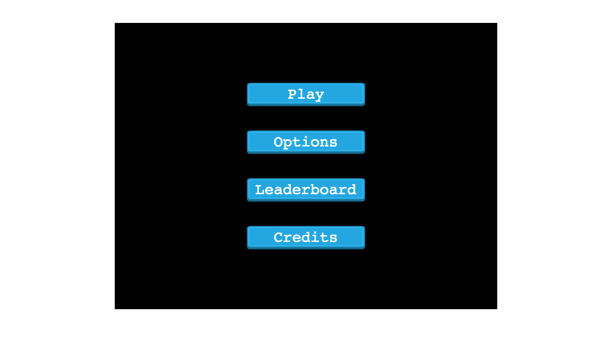

# JS-MazeRunner

## Description

This is an infinite runner game made with phaserJS and compiled with Webpack. Testing is done with jestJS. The name of the game was inspired by a movie of the same name. The Maze Runner is a 2014 American dystopian science fiction film directed by Wes Ball, in his directorial debut, based on James Dashner's 2009 novel of the same name. Don't look for a maze in this game though, you won't find one! Haha...

The aim of the game is to collect as many gold pieces as possible in sixty seconds.
All gold pieces can be found on platforms which you can jump up to by hitting the spacebar - Player can jump once, twice, or thrice consecutively.

More gold pieces are found on the highest platforms, so the player is encouraged to spend as much time as possible running and jumping on the high-up platforms and is penalized in lost earnings if they fall to the ground.

## Library Directory 📙

| Contents                    |
| --------------------------- |

| [Live Demo](#live-demo)     |
| [Screenshot](#screenshot)   |
| [Built With](#built-with-🛠) |
| [Contributing](#contributing🛠) |
| [Testing](#testing🛠) |
| [Authors](#authors)         |
| [License](#license)         |

## Live Demo

[Live demo]()

 ## Screenshot

## Built With 🛠

- JavaScript
- [PhaserJS](https://phaser.io/)
- [npm](https://www.npmjs.com/) with [webpack](https://webpack.js.org/)
- Linted with [ESLint](https://eslint.org/)
- Tested with [Jest](https://jestjs.io/)

## Contributing

- Fork the project
- Create your feature branch `git checkout -b awesome-feature`
- Commit your changes `git commit -m 'Awesome feature'`
- Push it `git push -u origin awesome-feature`
- Open a pull request using this branch

## Testing

This project's tests were created with [Jest](https://jestjs.io/). Once the project's dependencies have been installed (see Setup Instructions above), Jest will be available. **However**, the Jest Command Line Interface is only available if Jest is intalled globally:

1. Run `npm install jest --global` to make Jest globally available.

Once again, the project includes a handy script to run those tests for you:

2. Now you can run `npm run test` or simply `jest` to run the project's tests.

## Authors

### 👨‍💻 Uduak John

  
  
  

### 🤝 Contributing

Contributions, issues and feature requests are welcome!

Feel free to check the [issues page]().

### Show your support

Give a ⭐️ if you like this project!

### License

